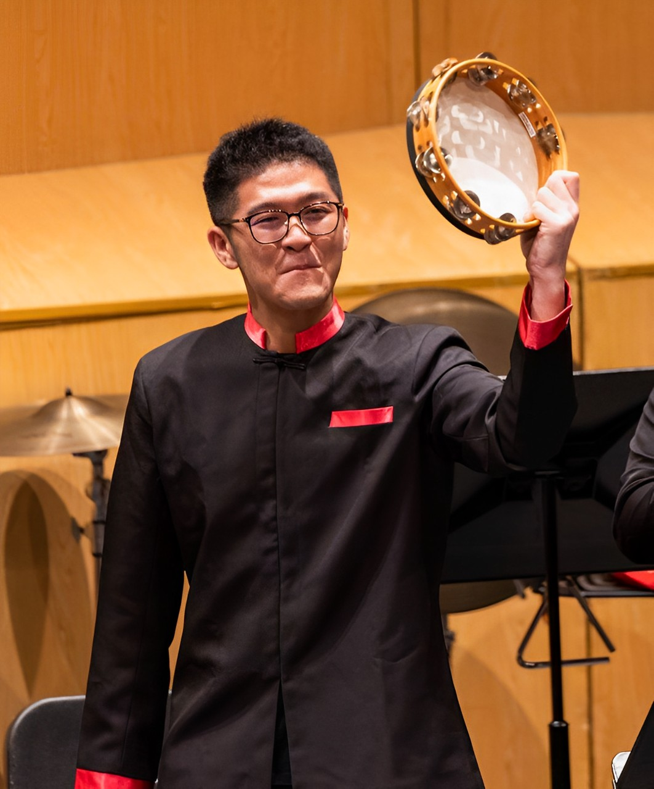
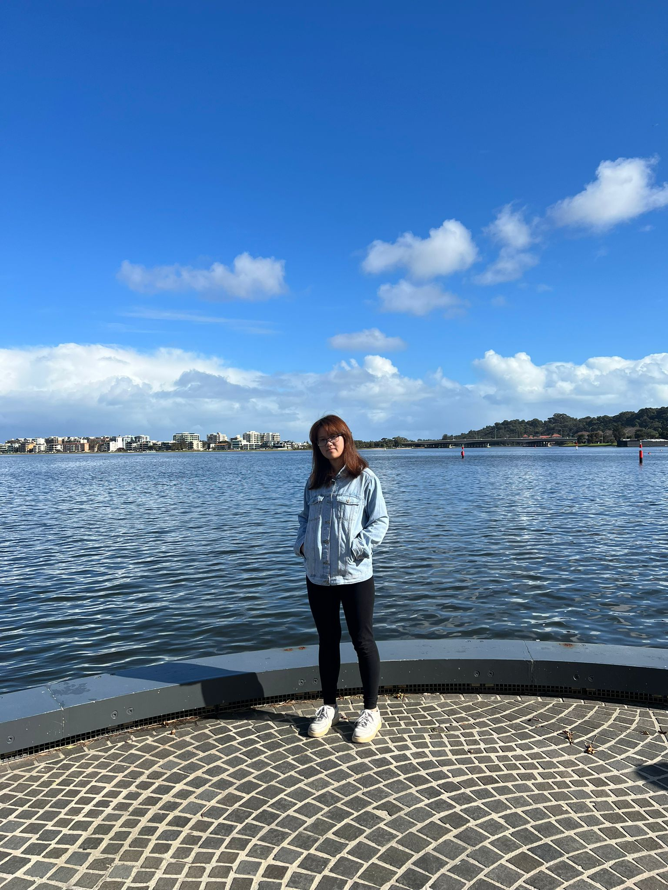
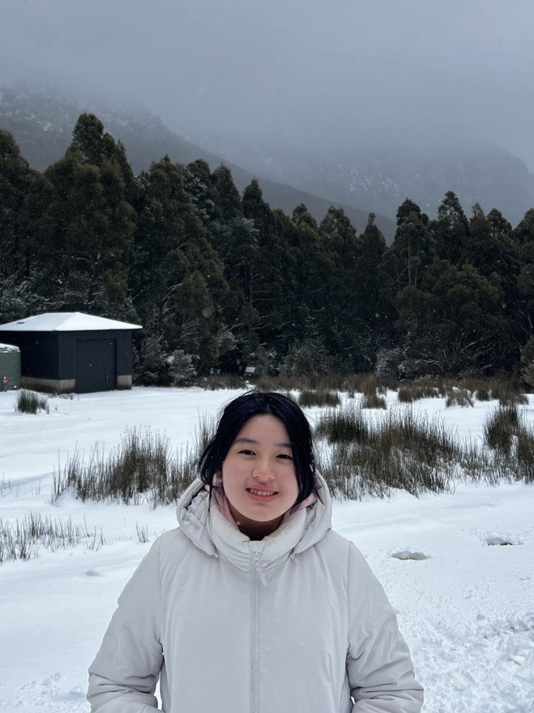
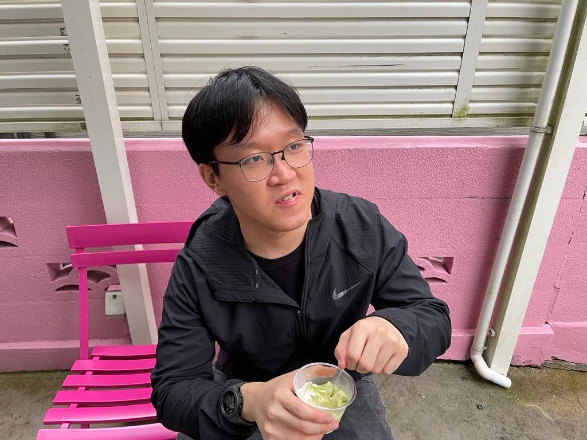

We are a team based in the [School of Computing, National University of Singapore](http://www.comp.nus.edu.sg).

You can reach us at the email `seer[at]comp.nus.edu.sg`

## Project team

### Chew En Le Jaryl

[[github](http://github.com/techjay-c)]
[[portfolio](team/techjay-c.md)]

* Role: Project Advisor

### Freddy Chen You Ren

[[github](https://github.com/freddychenyouren2)]

[[portfolio](team/freddychenyouren2.md)]

* Role: Team Lead
* Responsibilities: Team Lead

### Qin Yan Er

[[github](http://github.com/qyaner)]
[[portfolio](team/qyaner.md)]

* Role: Developer
* Responsibilities: Data

### Ruth Lim Sze Ern

[[github](http://github.com/ruth-lim)]
[[portfolio](team/ruth-lim.md)]

* Role: Developer
* Responsibilities: Dev Ops + Threading

### Roald Ong

[[github](http://github.com/SynapseProgramming)]
[[portfolio](team/synapseprogramming.md)]

* Role: Developer
* Responsibilities: UI
