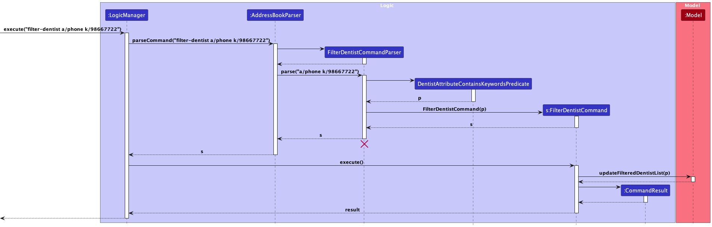



## **Acknowledgements**

* {list here sources of all reused/adapted ideas, code, documentation, and third-party libraries -- include links to the
  original source as well}

## **Setting up, getting started**

Refer to the guide [_Setting up and getting started_](SettingUp.md).

## **Design**

:bulb: **Tip:** The `.puml` files used to create diagrams in this document `docs/diagrams` folder. Refer to the [
_PlantUML Tutorial_ at se-edu/guides](https://se-education.org/guides/tutorials/plantUml.html) to learn how to create
and edit diagrams.

### Architecture

The ***Architecture Diagram*** given above explains the high-level design of the App.

Given below is a quick overview of main components and how they interact with each other.

**Main components of the architecture**

**`Main`** (consisting of
classes [`Main`](https://github.com/se-edu/addressbook-level3/tree/master/src/main/java/seedu/address/Main.java)
and [`MainApp`](https://github.com/se-edu/addressbook-level3/tree/master/src/main/java/seedu/address/MainApp.java)) is
in charge of the app launch and shut down.

* At app launch, it initializes the other components in the correct sequence, and connects them up with each other.
* At shut down, it shuts down the other components and invokes cleanup methods where necessary.

The bulk of the app's work is done by the following four components:

* [**`UI`**](#ui-component): The UI of the App.
* [**`Logic`**](#logic-component): The command executor.
* [**`Model`**](#model-component): Holds the data of the App in memory.
* [**`Storage`**](#storage-component): Reads data from, and writes data to, the hard disk.

[**`Commons`**](#common-classes) represents a collection of classes used by multiple other components.

**How the architecture components interact with each other**

The *Sequence Diagram* below shows how the components interact with each other for the scenario where the user issues
the command `delete 1`.

Each of the four main components (also shown in the diagram above),

* defines its *API* in an `interface` with the same name as the Component.
* implements its functionality using a concrete `{Component Name}Manager` class (which follows the corresponding
  API `interface` mentioned in the previous point).

For example, the `Logic` component defines its API in the `Logic.java` interface and implements its functionality using
the `LogicManager.java` class which follows the `Logic` interface. Other components interact with a given component
through its interface rather than the concrete class (reason: to prevent outside component's being coupled to the
implementation of a component), as illustrated in the (partial) class diagram below.

The sections below give more details of each component.

### UI component
The UI component handles the user-interface portion of the application.

The **API** of this component is specified
in [`Ui.java`](https://github.com/AY2324S1-CS2103T-W10-3/tp/blob/master/src/main/java/seedu/address/ui/Ui.java)

The UI consists of a `MainWindow` that is made up of parts
e.g.`CommandBox`, `ResultDisplay`, `PatientListPanel`, `StatusBarFooter` etc. All these, including the `MainWindow`,
inherit from the abstract `UiPart` class which captures the commonalities between classes that represent parts of the
visible GUI.

The `UI` component uses the JavaFX UI framework. The layout of these UI parts is defined in matching `.fxml` files that
are in the `src/main/resources/view` folder. For example, the layout of
the [`MainWindow`](https://github.com/AY2324S1-CS2103T-W10-3/tp/blob/master/src/main/java/seedu/address/ui/MainWindow.java)
is specified
in [`MainWindow.fxml`](https://github.com/AY2324S1-CS2103T-W10-3/tp/blob/master/src/main/resources/view/MainWindow.fxml)

The `UI` component,

* executes user commands using the `Logic` component.
* listens for changes to `Model` data so that the UI can be updated with the modified data.
* keeps a reference to the `Logic` component, because the `UI` relies on the `Logic` to execute commands.
* depends on some classes in the `Model` component, as it displays `Person` object residing in the `Model`.

### Logic component
The Logic component handles the execution of commands.

**API
** : [`Logic.java`](https://github.com/AY2324S1-CS2103T-W10-3/tp/blob/master/src/main/java/seedu/address/logic/Logic.java)

Here's a (partial) class diagram of the `Logic` component:

How the `Logic` component works:

1. When `Logic` is called upon to execute a command, it is passed to an `AddressBookParser` object which in turn creates
   a parser that matches the command (e.g., `DeletePatientCommandParser`) and uses it to parse the command. 
2. This results in a `Command` object (more precisely, an object of one of its subclasses e.g., `DeletePatientCommand`) which
   is executed by the `LogicManager`. 
3. The command can communicate with the `Model` when it is executed (e.g. to delete a person). 
4. The result of the command execution is encapsulated as a `CommandResult` object which is returned back from `Logic`.

The sequence diagram below illustrates the interactions within the `Logic` component, taking `execute("delete-patient 1")` API
call as an example.

:information_source: **Note:** The lifeline for `DeletePatientCommandParser` should end at the destroy marker (X) but due to a limitation of PlantUML, the lifeline reaches the end of diagram.

Here are the other classes in `Logic` (omitted from the class diagram above) that are used for parsing a user command:

How the parsing works:

* When called upon to parse a user command, the `AddressBookParser` class creates an `XYZCommandParser` (`XYZ` is a
  placeholder for the specific command name e.g., `AddPatientCommandParser`) which uses the other classes shown above to parse
  the user command and create a `XYZCommand` object (e.g., `AddPatientCommand`) which the `AddressBookParser` returns back as
  a `Command` object.
* All `XYZCommandParser` classes (e.g., `AddPatientCommandParser`, `DeletePatientCommandParser`, ...) inherit from the `Parser`
  interface so that they can be treated similarly where possible e.g, during testing.

### Model component

**API
** : [`Model.java`](https://github.com/se-edu/addressbook-level3/tree/master/src/main/java/seedu/address/model/Model.java)

The `Model` component,

* stores the ToothTracker address book data i.e., all `Patient`, `Dentist`, `Appointment`, and `Treatment` objects
(which are contained in a `UniquePatientList`, `UniqueDentistList`, `UniqueAppointmentList`, and `UniqueTreatmentList` objects respectively).
* stores the currently 'selected' `Patient`, `Dentist`, or `Appointment` objects (e.g., results of a `search-patient`, `search-dentist`, or `filter-appointment`)
  as corresponding separate _filtered_ lists which are exposed to outsiders as unmodifiable `ObservableList<Patient>`, `ObservableList<Dentist>` and `Observable<Appointment>`
  that can be 'observed' e.g. the UI can be bound to these lists so that the UI automatically updates when the data in the lists change.
* stores a `UserPref` object that represents the user’s preferences. This is exposed to the outside as
  a `ReadOnlyUserPref` objects.
* does not depend on any of the other three components (as the `Model` represents data entities of the domain, they
  should make sense on their own without depending on other components)

### Storage component

**API
** : [`Storage.java`](https://github.com/se-edu/addressbook-level3/tree/master/src/main/java/seedu/address/storage/Storage.java)

The `Storage` component,

* can save both address book data and user preference data in JSON format, and read them back into corresponding
  objects.
* inherits from both `AddressBookStorage` and `UserPrefStorage`, which means it can be treated as either one (if only
  the functionality of only one is needed).
* depends on some classes in the `Model` component (because the `Storage` component's job is to save/retrieve objects
  that belong to the `Model`)

### Common classes

Classes used by multiple components are in the `seedu.addressbook.commons` package.

--------------------------------------------------------------------------------------------------------------------

## **Implementation**

This section describes some noteworthy details on how certain features are implemented.

The features implemented are categorized into 4 sections:

1. [Dentist Features](#dentist-features)
2. [Patient Features](#patient-features)
3. [Appointment Features](#appointment-features)
4. [Treatment Features](#treatment-features)
5. [General Features](#general-features)

### Dentist Features

#### Adding a Dentist

The `add-dentist` command creates a new dentist record in ToothTracker. This command forms the fundamental business logic to represent dentists.

The activity diagram for creating a new dentist is illustrated as follows:

This sequence diagram shows the interactions between the various components during the execution of the `add-dentist` command:

##### Feature Details

1. Users provide essential dentist information, such as their name, phone number, specialization, years of experience and other optional details like email, address and tags.
2. In case of missing or invalid command arguments, the system prompts users with an error message to enter the command correctly.
3. The system cross-references the new dentist's name with existing records in the `Model` to prevent duplicate entries. If a duplicate is found, an error message informs the user.
4. If step 3 is completed without any exceptions, the new patient record is created and stored in the system.

##### Feature Considerations

For dentist specialization, broader terms like "orthodontics" are used instead of specifying the exact type of treatment (e.g., root canal, braces, scaling).
This approach prevents the "add-dentist" command from becoming excessively long.

The working hours of a dentist is not an attribute in the `add-dentist` command as dentists might not immediately know their
shifts when they first join, and it might change frequently.

We handle duplicates by not allowing multiple dentists of the same name to be created (eg. only 1 John Tan can exist in ToothTracker). We will allow multiple dentists of 
the same name to be created in future implementations. For now, if there are multiple dentists with the same name, add in additional information such as their last 3 digits of NRIC
as part of their name attribute.

#### Deleting a Dentist

The `delete-dentist` command deletes a dentist record in ToothTracker. This command forms the fundamental business logic to represent dentists.

The activity diagram for deleting a dentist is illustrated as follows:

This sequence diagram shows the interactions between the various components during the execution of the `delete-dentist` command:

##### Feature Details

1. The user specifies a dentist id that represents a `Dentist` to be edited.
2. If an invalid `DENTIST_ID` is provided, an error is thrown and the user is prompted to enter the command correctly via an error message.
3. The Dentist is cross-referenced in the `Model` to check if it exists. If it does not, then an error is raised to inform the user.
4. If step 3 completes without any exceptions, then the `Dentist` is successfully deleted.

##### Feature Considerations

In implementing the delete feature, we needed proper error handling and validation to ensure ToothTracker's robustness and provide clear guidance to the user.
Our approach validates dentist ID and shows an error message if the dentist does not exist.
This is in comparison to allowing commands to fail silently if the dentist specified does not exist.

- Pros: Prevents invalid operations and provides immediate feedback to the user, helping to correct mistakes.
- Cons: Additional validation checks add complexity to the code.

#### Searching for a dentist

The `search-dentist` command finds dentist records in ToothTracker by allowing users to enter a specific `DENTIST_ID` or
name-related keywords.

The activity diagram for searching for a dentist is illustrated as follows:

This sequence diagram shows the interactions between the various components during the execution of the `search-dentist` command:

##### Feature Details
1. Users initiate a search for a dentist using either a unique `DENTIST_ID` or by inputting specific `KEYWORDS` that might match a dentist's name.
2. If the user opts for an ID-based search, the system processes the request to return a single record that matches the provided `DENTIST_ID`.
3. If keywords are used, the system performs a broader search by comparing the keywords as substrings with the names in the dentist records.
4. In scenarios where the search criteria do not correspond with any existing records (either no matching ID or keywords), the system generates an error message informing the user of the unsuccessful search attempt.
5. When matches are found, the system displays a list of dentists whose records meet the search criteria.

##### Feature Considerations

The `search-dentist` feature in ToothTracker focuses on searching using either a unique `DENTIST_ID` or keywords matching a dentist's name,
prioritizing speed and simplicity in accessing dentist records. For more complex searching which requires additional dentist attributes, users
are recommended to use the `filter-dentist` command instead. This approach ensures a balanced functionality within ToothTracker, offering a balance
between quick searches for immediate needs while also accommodating more complex and attribute-specific inquiries.

#### Filtering a dentist

The `filter-dentist` command in ToothTracker provides users with a more refined search functionality, allowing them to filter dentist records based on
specific criteria beyond just `DENTIST_ID` or name-related keywords. This feature offers a versatile and detailed search capability for users who
require precise results from the dentist records database.

The activity diagram for filtering dentists is illustrated as follows:

This sequence diagram shows the interactions between the various components during the execution of the `filter-dentist` command:

##### Feature Details
1. Users initiate a filter for a dentist by providing various filter criteria such as SPECIALIZATION, EXPERIENCE, TAGS, and more.
These criteria allow users to search for dentists with specific attributes.
2. ToothTracker processes the user's filter criteria and matches them against the dentist records in the database.
3. Dentists that meet the filter criteria are displayed as search results, providing users with a list of dentists that fulfill their specific requirements.
4. If no matches are found for the given filter criteria, the system informs the user that no results were found based on the specified filters.

##### Feature Considerations

The `filter-dentist` feature in ToothTracker is tailored for users who require precise control over their dentist searches. Unlike the `search-dentist` command,
which primarily relies on `DENTIST_ID` and name-related keywords, the `filter-dentist` command operates by filtering based on specific attributes within a dentist's record.

To ensure the validity of the filter criteria, the  filter-dentist command conducts validation checks to confirm that the selected attribute for filtering is a valid attribute
associated with a dentist's record.

It is important to note that the filter-dentist feature does not perform validation checks within each attribute to verify whether the entered
keyword is of a valid type for that particular attribute. Users are responsible for inputting keywords that are meaningful and applicable to the chosen attribute.

### Patient Features

#### Adding a Patient

The `add-patient` command creates a new patient record in ToothTracker.          

The activity diagram for creating a new patient is illustrated as follows:

The sequence diagram of the `add-patient` command:

##### Feature Details

1. Users provide essential patient information, such as their name, phone number, gender, birthday and optional details such as remark, treatment, email, address and tags.
2. In case of missing or invalid command arguments, the system prompts users with an error message to enter the command correctly.
3. The system cross-references the new patients name with existing records in the `Model` to prevent duplicate entries. If a duplicate is found, an error message informs the user.
4. If step 3 is completed without any exceptions, the new patient record is created and stored in the system.

##### Feature Considerations
For the optional `Treatment` field, should the user opt to enter a treatment, it is mandatory that the specified treatment already exists within ToothTracker.
If this condition is not met, the user will receive an error message.

#### Deleting a Patient

The `delete-patient` command deletes a patient record in ToothTracker. 

The activity diagram for deleting a patient is illustrated as follows:

This sequence diagram shows the interactions between the various components during the execution of the `delete-patient` command:

##### Feature Details

1. The user specifies a patient id that represents a `Patient` to be deleted.
2. If an invalid `PATIENT_ID` is provided, an error is thrown and the user is prompted to enter the command correctly via an error message.
3. The Patient is cross-referenced in the `Model` to check if it exists. If it does not, then an error is raised to inform the user.
4. If step 3 completes without any exceptions, then the `Patient` is successfully deleted.

##### Feature Considerations

In implementing the delete feature, we needed proper error handling and validation to ensure ToothTracker's robustness and provide clear guidance to the user.
Our approach validates patient ID and shows an error message if the patient does not exist.
This is in comparison to allowing commands to fail silently if patient does not exist.

- Pros: Prevents invalid operations and provides immediate feedback to the user, helping to correct mistakes.
- Cons: Additional validation checks add complexity to the code.

#### Searching for a patient

The `search-patient` command finds patient records in ToothTracker by allowing users to enter a specific `PATIENT_ID` or
name-related keywords.

The activity diagram for searching for a patient is illustrated as follows:

This sequence diagram shows the interactions between the various components during the execution of the `search-patient` command:

##### Feature Details
1. Users initiate a search for a patient using either a unique `PATIENT_ID` or by inputting specific `KEYWORDS` that might match a patient's name.
2. If the user opts for an ID-based search, the system processes the request to return a single record that matches the provided `PATIENT_ID`.
3. If keywords are used, the system performs a broader search by comparing the keywords as substrings with the names in the patient records.
4. In scenarios where the search criteria do not correspond with any existing records (either no matching ID or keywords), the system generates an error message informing the user of the unsuccessful search attempt.
5. When matches are found, the system displays a list of patients whose records meet the search criteria.

##### Feature Considerations

The `search-patient` feature in ToothTracker focuses on searching using either a unique `PATIENT_ID` or keywords matching a patient's name,
prioritizing speed and simplicity in accessing patient records. For more complex searching which requires additional patient attributes, users
are recommended to use the `filter-patient` command instead. This approach ensures a balanced functionality within ToothTracker, offering a balance
between quick searches for immediate needs while also accommodating more complex and attribute-specific inquiries.

#### Filtering a patient

The `filter-patient` command in ToothTracker provides users with a more refined search functionality, allowing them to filter patient records based on
specific criteria beyond just `PATIENT_ID` or name-related keywords. This feature offers a versatile and detailed search capability for users who
require precise results from the patient records database.

The activity diagram for filtering patient is illustrated as follows:

This sequence diagram shows the interactions between the various components during the execution of the `filter-patient` command:

##### Feature Details
1. Users initiate a filter for a patient by providing various filter criteria such as Remarks, Treatment and more.
   These criteria allow users to search for patients with specific attributes.
2. ToothTracker processes the user's filter criteria and matches them against the patient records in the database.
3. Patients that meet the filter criteria are displayed as search results, providing users with a list of patients that fulfill their specific requirements.
4. If no matches are found for the given filter criteria, the system informs the user that no results were found based on the specified filters.

##### Feature Considerations

The `filter-patient` feature in ToothTracker is tailored for users who require precise control over their patient searches. Unlike the `search-patient` command,
which primarily relies on `PATIENT_ID` and name-related keywords, the `filter-patient` command operates by filtering based on specific attributes within a patient's record.

To ensure the validity of the filter criteria, the  filter-patient command conducts validation checks to confirm that the selected attribute for filtering is a valid attribute
associated with a patient's record.

It is important to note that the filter-patient feature does not perform validation checks within each attribute to verify whether the entered
keyword is of a valid type for that particular attribute. Users are responsible for inputting keywords that are meaningful and applicable to the chosen attribute.

### Appointment Features

#### Adding an Appointment

The `add-appointment` command creates a new appointment record in ToothTracker.

The activity diagram for creating a new appointment is illustrated as follows:

The sequence diagram shows the interactions between the various components during the execution of the `add-appointment` command:

##### Feature Details

1. Users provide essential appointment information, such as the dentist ID, patient ID, appointment start time and treatment name.
2. In case of missing or invalid command arguments, the system prompts users with an error message to enter the command correctly.
3. The system retrieves information about the treatment cost, duration, dentist and patient from the `Model` using the information provided by the user.
4. The system checks the new appointment's time slot with existing appointments in the `Model` to prevent clashing appointments.
If a timing clash is found, an error message informs the user.
5. If step 4 is completed without any exceptions, the new appointment record is created and stored in the system.

##### Feature Considerations

For the dentist ID, patient ID and treatment field, it is mandatory that the specified dentist, patient and treatment exists in ToothTracker.
If these conditions are not met, the user will receive an error message.

#### Deleting an Appointment

The `delete-appointment` command deletes an appointment record from ToothTracker.

The activity diagram for deleting an appointment is illustrated as follows:

The sequence diagram shows the interactions between the various components during the execution of the `delete-appointment` command:

##### Feature Details

1. The user specifies an appointment id that represents an `Appointment` to be deleted.
2. If an invalid `APPOINTMENT_ID` is provided, an error is thrown and the user is prompted to enter the command correctly via an error message.
3. The Appointment is cross-referenced in the `Model` to check if it exists. If it does not, then an error is raised to inform the user.
4. If step 3 completes without any exceptions, then the `Appointment` is successfully deleted.

##### Feature Considerations

In implementing the delete feature, we needed proper error handling and validation to ensure ToothTracker's robustness and provide clear guidance to the user.
Our approach validates appointment ID and shows an error message if the appointment does not exist.
This is in comparison to allowing commands to fail silently if appointment does not exist.

- Pros: Prevents invalid operations and provides immediate feedback to the user, helping to correct mistakes.
- Cons: Additional validation checks add complexity to the code.

#### Filtering an Appointment

The `filter-appointment` command filters appointments by DENTIST_ID or PATIENT_ID.

The activity diagram for filtering an appointment is illustrated as follows:

The sequence diagram shows the interactions between the various components during the execution of the `filter-appointment` command:

##### Feature Details

1. Users initiate a filter for appointments using either a unique `DENTIST_ID` or a unique `PATIENT_ID`.
2. If an invalid `DENTIST_ID` or `PATIENT_ID` is provided, an error is thrown and the user is prompted to enter the command correctly via an error message. 
3. If the user opts to filter by `DENTIST_ID`, the system processes the request to return a list of appointments with the specific dentist. 
4. If the user opts to filter by `PATIENT_ID`, the system processes the request to return a list of appointments with the specific patient. 
5. If there are no appointments with the specific dentist or patient, the system informs the user that no appointments were found with the specific dentist or patient.

##### Feature Considerations

Validity checks are performed to ensure that the `DENTIST_ID` or `PATIENT_ID` are valid and that they type of ID to filter by is clearly stated.
Otherwise, user would receive an error message that guides them to input the right command and details.

If no appointments with the specific dentist or patient are found in ToothTracker, it should be clearly
communicated to the user instead of just displaying an empty list. A message stating that no appointments with the
specified `DENTIST_ID` or `PATIENT_ID` are found would be displayed to the user.

### Treatment Features

#### Adding a Treatment

The `add-treatment` command creates a new treatment record in ToothTracker.

The activity diagram for creating a new treatment is illustrated as follows:

The sequence diagram of the `add-treatment` command:

##### Feature Details
1. Users would key in the available treatments in their clinic, specifying the treatment name, cost and its duration.
2. In case of missing or invalid command arguments, the system prompts users with an error message to enter the command correctly.
3. The system cross-references the new treatment name with existing records in the `Model` to prevent duplicate entries. If a duplicate is found, an error message informs the user.
4. If step 3 is completed without any exceptions, the new treatment record is created and stored in the system.

#### Listing a Treatment

The `list-treatment` command would list all treatments recorded in ToothTracker.

##### Feature Details
1. Users would key in the `list-treatment`
2. All available treatments would be listed in the command box.
3. In the event that there are no treatments, ToothTracker would display a message in the command box.

##### Feature Considerations
- Due to the space constraints of ToothTracker, only treatment names would be displayed to the user. 
Ideally, cost and duration of each treatment should be shown to the user. However, this would clutter
up the command box pretty quickly.
- Ideally, another window would be created, which would display all available treatments and  their 
associated costs and durations.

#### Deleting a Treatment

The `delete-treatment` command deletes a treatment record in ToothTracker.

The activity diagram for deleting a treatment is illustrated as follows:

This sequence diagram shows the interactions between the various components during the execution of the `delete-treatment` command:

### General Features

--------------------------------------------------------------------------------------------------------------------

## **Documentation, logging, testing, configuration, dev-ops**

* [Documentation guide](Documentation.md)
* [Testing guide](Testing.md)
* [Logging guide](Logging.md)
* [Configuration guide](Configuration.md)
* [DevOps guide](DevOps.md)

--------------------------------------------------------------------------------------------------------------------

## **Appendix: Requirements**

### Product scope

**Target user profile**:
Front Desk Dental Clinic Administrative Staff who

* need to obtain patient/dentist personal details quickly
* need find out the most recent appointments
* prefer desktop apps over other types
* can type fast
* prefers typing to mouse interactions
* is reasonably comfortable using CLI apps

**Value proposition**: Easily obtain patient/dentist records through a CLI

### User stories

Priorities: High (must have) - `* * *`, Medium (nice to have) - `* *`, Low (unlikely to have) - `*`

| Priority | As a …​      | I want to …​                                                      | So that I can…​                                 |
|----------|--------------|-------------------------------------------------------------------|-------------------------------------------------|
| `* * *`  | receptionist | create new patient profiles by entering their name, address, etc. | i can maintain patient records                  |
| `* * *`  | receptionist | create a new dentist profile                                      | maintain dentist records                        |
| `* * *`  | receptionist | delete a patient/dentist                                          | remove people who are no longer with the clinic |
| `* * *`  | receptionist | list all patients/dentists                                        | find out the total number of patients/dentists  |
| `* * *`  | receptionist | edit a dentist/patient profile                                    | keep my records up to date                      |
| `* * *`  | receptionist | search for patients by name or ID                                 | i have quick access to patient profiles         |
| `* * *`  | receptionist | search for dentists by name or ID                                 | i have quick access to dentist profiles         |
| `* *`    | receptionist | view costs of various dental treatments                           | tell customers the price of a dental treatment  |

*{More to be added}*

### Use cases

(For all use cases below, the **System** is the `AddressBook` and the **Actor** is the `user`, unless specified
otherwise)

---

**Use case: Add a Dentist**

**MSS**

1. User submits a request to create a new dentist, and provides information about the dentist.
2. ToothTracker acknowledges the request to add a new dentist.

Use case ends.

**Extensions**

- **1a. User inputs an invalid command.**
    - ToothTracker identifies the command error.
        - ToothTracker prompts the user to make the necessary adjustments and provide the command in the correct format.
    - Steps within 1a repeat until a valid `add-dentist` command is provided.

      Use case continues from step 2.

- **1b. ToothTracker finds a pre-existing dentist entry.**
    - ToothTracker alerts the user about the duplicate entry.
    - Steps within 1b loop until a new, unique entry is provided.

      Use case continues from step 2.

**Use Case: Search Dentist**

**MSS**

1. User submits a request to search for a dentist:
    - User specifies search criteria, which can be either a dentist ID [DENTIST ID] or a dentist name [dentist name].

2. ToothTracker searches for the dentist based on the criteria:
    - If the request specifies [DENTIST ID]:
        - ToothTracker looks for a dentist with the matching ID.
    - If the request specifies [dentist name]:
        - ToothTracker searches for a dentist with the matching name.

3. ToothTracker displays the search results:
    - If one or more matching dentists are found:
        - ToothTracker lists the matching dentists and their details.

   Use Case Ends.

**Extensions**

* 2a. The list of dentists is empty:
    - ToothTracker displays a message indicating that no dentists are available.

      Use Case Ends.

* 3a. No matching dentist found:
    - ToothTracker displays a message indicating no matching dentists were found.

      Use Case Ends.

* 3b. Invalid dentist ID or name format:
    - ToothTracker displays an error message.

      Use Case Ends.

**Use Case: Delete a Dentist**

**MSS**

1. User submits a request to delete a dentist:
    - User specifies the dentist ID [DENTIST ID] or dentist name [dentist name] to delete.

2. ToothTracker searches for the dentist entry:
    - If the request specifies [DENTIST ID]:
        - ToothTracker looks for a dentist with the matching ID.
    - If the request specifies [dentist name]:
        - ToothTracker searches for a dentist with the matching name.

3. ToothTracker shows the dentist entry that matches the request:
    - If a match is found:
        - User confirms the deletion of the specified dentist.

4. ToothTracker deletes the dentist:
    - Dentist entry is removed from the database.

      Use Case Ends.

**Extensions**

* 2a. The list is empty:
    - ToothTracker displays a message indicating no dentists are available.

      Use Case Ends.

* 3a. No matching dentist found:
    - ToothTracker displays an error message.

      Use Case resumes at step 2.

* 3b. Invalid dentist ID or name format:
    - ToothTracker displays an error message.

      Use Case ends.

* 4a. Deletion is cancelled by the user:
    - ToothTracker cancels the deletion process.
    - Use Case ends.

**Use case: List Dentist Data**

**MSS**

1. User submits a request to list all dentist data.
2. ToothTracker retrieves the list of all dentist data saved in the system.
3. ToothTracker displays the list of dentist data to the user.

   Use case ends.

**Extensions**

- **1a. User inputs an invalid command.**
    - ToothTracker identifies the command error.
        - ToothTracker prompts the user to make the necessary adjustments and provide the command in the correct format.
    - Steps within 1a repeat until a valid `list-dentist` command is provided.

      Use case continues from step 2.

- **2a. No dentist data available.**
    - ToothTracker checks and finds that there are no dentist records in the system.
    - ToothTracker informs the user that no dentist data is available.

      Use case continues from step 2.

**Use case: Add a Patient**

**MSS**

1. User submits a request to create a new patient, and provides information about the patient.
2. ToothTracker acknowledges the request to add a new patient.

Use case ends.

**Extensions**

- **1a. User inputs an invalid command.**
    - ToothTracker identifies the command error.
        - ToothTracker prompts the user to make the necessary adjustments and provide the command in the correct format.
    - Steps within 1a repeat until a valid `add-patient` command is provided.

      Use case continues from step 2.

- **1b. ToothTracker finds a pre-existing patient entry.**
    - ToothTracker alerts the user about the duplicate entry.
    - Steps within 1b loop until a new, unique entry is provided.
      Use case continues from step 2.
     
- **1c. User inputs a treatment that does not exist in ToothTracker**
    - ToothTracker checks ToothTracker and finds that the treatment provided does not exist.
    - ToothTracker alerts the user that the treatment is not provided in the clinic.
    - Steps within 1c loop until an existing treatment is provided.

      Use case resumes from step 2.

* 3a. No matching patient found:
    - ToothTracker displays a message indicating no matching patients were found.

      Use Case Ends.

* 3b. Invalid patient ID or name format:
    - ToothTracker displays an error message.

      Use Case Ends.

**Use Case: Delete a Patient**

**MSS**

1. User submits a request to delete a patient:
    - User specifies the patient ID [PATIENT ID] or patient name [PATIENT NAME] to delete.

2. ToothTracker searches for the patient entry:
    - If the request specifies [PATIENT ID]:
        - ToothTracker looks for a patient with the matching ID.
    - If the request specifies [PATIENT NAME]:
        - ToothTracker searches for a patient with the matching name.

3. ToothTracker shows the patient entry that matches the request:
    - If a match is found:
        - User confirms the deletion of the specified patient.

4. ToothTracker deletes the patient:
    - Patient entry is removed from the database.

      Use Case Ends.

**Extensions**

* 2a. The list is empty:
    - ToothTracker displays a message indicating no patients are available.

      Use Case Ends.

* 3a. No matching patient found:
    - ToothTracker displays an error message.

      Use Case resumes at step 2.

* 3b. Invalid patient ID or name format:
    - ToothTracker displays an error message.

      Use Case ends.

* 4a. Deletion is cancelled by the user:
    - ToothTracker cancels the deletion process.
    - Use Case ends.

**Use case: List Patient Data**

**MSS**

1. User submits a request to list all patient data.
2. ToothTracker retrieves the list of all patient data saved in the system.
3. ToothTracker displays the list of patients to the user.

   Use case ends.

**Extensions**

- **1a. User inputs an invalid command.**
    - ToothTracker identifies the command error.
        - ToothTracker prompts the user to make the necessary adjustments and provide the command in the correct format.
    - Steps within 1a repeat until a valid `list-patient` command is provided.

      Use case continues from step 2.

- **2a. No patient data available.**
    - ToothTracker checks and finds that there are no patient records in the system.
    - ToothTracker informs the user that no patient data is available.

      Use case continues from step 2.

**Use Case: Search Patient**

**MSS**

1. User submits a request to search for a patient:
    - User specifies search criteria, which can be either a patient ID [PATIENT ID] or a patient name [PATIENT NAME].

2. ToothTracker searches for the patient based on the criteria:
    - If the request specifies [PATIENT ID]:
        - ToothTracker looks for a patient with the matching ID.
    - If the request specifies [PATIENT NAME]:
        - ToothTracker searches for a patient with the matching name.

3. ToothTracker displays the search results:
    - If one or more matching patients are found:
        - ToothTracker lists the matching patients and their details.

   Use Case Ends.

**Extensions**

* 2a. The list of patients is empty:
    - ToothTracker displays a message indicating that no patients are available.

      Use Case Ends.

* 3a. No matching patients found:
    - ToothTracker displays a message indicating no matching patients were found.

      Use Case Ends.

* 3b. Invalid patient ID or name format:
    - ToothTracker displays an error message.

      Use Case Ends.

**Use case: Add an Appointment**

**MSS**

1. User submits a request to add a new future appointment, providing information about the appointment.
 Information includes dentist ID, patient ID, appointment start time and treatment provided during the appointment. 
2. ToothTracker acknowledges the request to add the new appointment.

   Use case ends.

**Extensions**

- **1a. User inputs an invalid command.**
    - ToothTracker identifies the command error.
        - ToothTracker prompts the user to make the necessary adjustments and provide the command in the correct format.
    - Steps within 1a repeat until a valid `add-appointment` is provided.

      Use case continues from step 2.

- **1b. User inputs a treatment that does not exist in the database**
    - ToothTracker checks the database and finds that the treatment provided does not exist.
    - ToothTracker alerts the user that the treatment is not provided in the clinic.
    - Steps within 1b loop until an existing treatment is provided.

- **1c. User inputs a dentist or patient ID that does not exist in the database**
    - ToothTracker checks the database and finds that the dentist or patient ID provided does not exist.
    - ToothTracker alerts the user that the patient or dentist with the provided patient or dentist ID does not exist in this clinic.
    - Steps within 1c loop until valid dentist and patient IDs are provided.

- **1d. User inputs an appointment time slot that clashes with an existing one in the database**
    - ToothTracker checks the database and finds that the appointment to be added clashes with an existing one.
    - ToothTracker alerts the user about the clashing appointments.
    - Steps within 1d loop until an appointment time slot that does not clash with an existing appointment is provided.

      Use case resumes at step 1.

**Use Case: Delete an Appointment**

**MSS**

1. User submits a request to delete an appointment:
    - User specifies the appointment ID [APPOINTMENT ID] to delete.

2. ToothTracker searches for the appointment entry:
   - ToothTracker looks for an appointment with the matching ID.

3. ToothTracker shows the appointment entry that matches the request:
    - If a match is found:
        - User confirms the deletion of the specified appointment.

4. ToothTracker deletes the appointment:
    - Appointment entry is removed from the database.

      Use Case Ends.

**Extensions**

* 2a. The list is empty:
    - ToothTracker displays a message indicating no appointments are saved in its system.

      Use Case Ends.

* 3a. No matching appointment found:
    - ToothTracker displays an error message.

      Use Case resumes at step 2.

* 3b. Invalid appointment ID:
    - ToothTracker displays an error message.

      Use Case ends.

* 4a. Deletion is cancelled by the user:
    - ToothTracker cancels the deletion process.
    - Use Case ends.

**Use case: List Appointment Data**

**MSS**

1. User submits a request to list all appointment data.
2. ToothTracker retrieves the list of all appointment data saved in the system.
3. ToothTracker displays the list of appointments to the user.

   Use case ends.

**Extensions**

- **1a. User inputs an invalid command.**
    - ToothTracker identifies the command error.
        - ToothTracker prompts the user to make the necessary adjustments and provide the command in the correct format.
    - Steps within 1a repeat until a valid `list-appointment` command is provided.

      Use case continues from step 2.

- **2a. No appointment data available.**
    - ToothTracker checks and finds that there are no appointment records in the system.
    - ToothTracker informs the user that no appointment data is available.

      Use case continues from step 2.

**Use Case: Filter Appointments**

**MSS**

1. User submits a request to filter appointments:
    - User specifies filter criteria, which can be either a dentist ID [DENTIST ID] or a patient ID [PATIENT ID].

2. ToothTracker filters appointment list based on the criteria:
    - If the request specifies [DENTIST ID]:
        - ToothTracker filters the appointment list by the specified dentist ID.
    - If the request specifies [PATIENT ID]:
        - ToothTracker filters the appointment list by the specified patient ID.

3. ToothTracker displays the filter results:
   - ToothTracker lists the matching appointments and their details.

   Use Case Ends.

**Extensions**

* 2a. The list of appointment is empty:
    - ToothTracker displays a message indicating that no appointments are saved in its system.

      Use Case Ends.

* 3a. No matching appointments found:
    - ToothTracker displays a message indicating no matching appointments were found.

      Use Case Ends.

* 3b. Invalid appointment ID:
    - ToothTracker displays an error message.

      Use Case Ends.

**Use case: Add Treatment**

**MSS**

1. User submits a request to add a new type of dental treatment, providing information about the treatment name and its
   cost.
2. ToothTracker acknowledges the request to add the new treatment.

   Use case ends.

**Extensions**

- **1a. User inputs an invalid command.**
    - ToothTracker identifies the command error.
        - ToothTracker prompts the user to make the necessary adjustments and provide the command in the correct format.
    - Steps within 1a repeat until a valid `add-treatment` is provided.

      Use case continues from step 2.

- **1b. User inputs incomplete or missing information.**
    - ToothTracker detects that the user did not provide all required information, such as the treatment name or cost.
    - ToothTracker prompts the user to provide both the treatment name and its cost.

      Use case resumes at step 1.

- **1c. User inputs an invalid cost.**
    - ToothTracker checks the provided cost and determines that it is not a valid numeric value.
    - ToothTracker prompts the user to provide a valid numeric value.

      Use case resumes at step 1.

- **1d. Duplicate treatment name.**
    - ToothTracker checks the database and finds that a treatment with the same name.
    - ToothTracker alerts the user about the duplicate entry.
    - Steps within 1d loop until a new, unique treatment name is provided.

      Use case resumes at step 1.

**Use Case: Delete a Treatment**

**MSS**

1. User submits a request to delete a treatment:
    - User specifies the [treatment_name] to delete.

2. ToothTracker searches for the treatment entry.

3. If a match is found, ToothTracker deletes the treatment.
      - Use Case Ends.

**Extensions**

* 2a. No treatments match the given treatment name:
    - ToothTracker displays a message indicating no treatments are available.
    - Repeat step 1 till the user enters a treatment which exists.
    - Use Case Ends.

**Use case: List Treatment Data**

**MSS**

1. User submits a request to list all treatment data.
2. ToothTracker retrieves the list of all treatments saved in the system.
3. ToothTracker displays all available treatments in the command result box.

   Use case ends.

**Extensions**

- **1a. User inputs an invalid command.**
    - ToothTracker identifies the command error.
        - ToothTracker prompts the user to make the necessary adjustments and provide the command in the correct format.
    - Steps within 1a repeat until a valid `list-treatment` command is provided.

      Use case continues from step 2.

- **2a. No treatment data available.**
    - ToothTracker checks and finds that there are no treatments in the system.
    - ToothTracker informs the user that no treatments are available.

      Use case continues from step 2.

*{More to be added}*

### Non-Functional Requirements

1. Should work on any _mainstream OS_ as long as it has Java `11` or above installed.
2. Should be able to hold up to 1000 Dentists and 1000 Patients without any major performance issues.
3. A user with above average typing speed for regular English text (i.e. not code, not system admin commands) should be
   able to accomplish most of the tasks faster using commands than using the mouse.
4. Should not use more than 2GB of RAM
5. Jar file size should not exceed 150MB

### Glossary

* **Mainstream OS**: Windows, Linux, Unix, OS-X
* **CLI**: command line interface
* **GUI**: graphical user interface, a visual way of interacting with a computer program
* **PlantUML**: A tool which is used to create diagrams
* **API**: Application Programming Interface

--------------------------------------------------------------------------------------------------------------------

# **Appendix: Instructions for manual testing**

Given below are instructions to test the app manually.

:information_source: **Note:** These instructions only provide a starting point for testers to work on;
testers are expected to do more *exploratory* testing.

## Launch and shutdown

### Initial launch

1. Download the jar file and copy into an empty folder
2. Double-click the jar file. 
   Expected: Shows the GUI with a set of sample patients and dentists. The window size may not be
   optimum. It is recommended to use ToothTracker at full screen.

### Saving window preferences

1. Resize the window to an optimum size. Move the window to a different location. Close the window.
2. Re-launch ToothTracker by double-clicking the jar file. 
       Expected: The most recent window size and location is retained.
3. _{ more test cases …​ }_

## Dentist

### Adding a Dentist

Adding a dentist into ToothTracker's Dentist List.

`add-dentist n/Xander Chua p/98986443 s/Endodontics y/8 `

Expected Output in the Dentist List: New dentist added into the Dentist List. The email and address will contain Default placeholders.

Expected Output in the Command Output Box: New dentist added message is displayed with the dentist credentials.

`add-dentist n/Oliver Lim`

Expected Output in the Command Output Box: Error message for invalid command format, prompting users with correct attributes to include.

### Listing all Dentists

Prerequisite: There is at least 1 Dentist stored in ToothTracker
`list-dentist`

Expected Output in the Dentist List. All Dentists stored in ToothTracker is displayed.

Expected Output in the Command Output Box: Listed all Dentist!

### Edit a Dentist

Prerequisite: There is at least 1 Dentist stored in ToothTracker.
In this example, we assume there are two dentists with the following attributes: 
**Dentist 1**
* Name: `Xavier Tan`
* Phone: `90895772`
* Email: `xaviertan@hotmail.com`
* Address: `Blk 33 #11-132, Serangoon Road, S335291`
* Specialization: `Endodontics`
* Yoe (Years of Experience): `8`
* Dentist ID: `1`
* Tag: `Professional`

**Dentist 2**
* Name: `Bernard Tan`
* Phone: `98983492`
* Email: `bernardtan@hotmail.com`
* Address: `No Address Provided.`
* Specialization: `Orthodontics`
* Yoe (Years of Experience): `2`
* Dentist ID: `4`
* Tag: `Trainee`

In each of the test case below, we further assume that the state of Dentist objects are always starting from the above attributes.

`edit-dentist 1 n/Xaveric Tan Ming Yuan`

Expected Output in the Dentist List: The name of dentist with ID 1 is changed to `Xaveric Tan Ming Yuan`.

Expected Output in the Command Output Box: Dentist successfully edited message, along with the updated attributes.

`edit-dentist 4 p/98984477 e/btan@yahoo.com`

Expected Output in the Dentist List: The phone of the dentist with ID 4 is changed to `98984477`, and the email is changed to `btan@yahoo.com`.

Expected Output in the Command Output Box: Similar to above.

`edit-dentist 4 h/Blk 653 #03-44, Bishan Ave 4, S622653`

Expected Output in the Dentist List: The address of the dentist with ID 4 is changed to `Blk 653 #03-44, Bishan Ave 4, S622653`.

Expected Output in the Command Output Box: Similar to above.

`edit-dentist 99`

Expected Output in the Dentist List: No dentist is edited.

Expected Output in the Command Output Box: Error details shown for invalid ID provided.

`edit-dentist`

Expected Output in the Dentist List: No dentist is edited.

Expected Output in the Command Output Box: Error details shown for invalid command format.

`edit-dentist 1 n/Bernard Tan`

Expected Output in the Dentist List: No dentist is edited.

Expected Output in the Command Output Box: Error details shown for attempting to edit a dentist into another existing dentist.

### Searching for a Dentist by Keyword
Prerequisite: There are only two dentists named `Xavier Tan` and `Bernard Tan` stored in ToothTracker.

`search-dentist Xavier`

Expected Output in the Dentist List: `Xavier Tan` dentist is displayed.

Expected Output in the Command Output Box: 1 dentists listed!

`search-dentist Bernard`

Expected Output in the Dentist List: `Bernard Tan` dentist is displayed.

Expected Output in the Command Output Box: 1 dentists listed!

`search-dentist Tan`

Expected Output in the Dentist List: `Xavier Tan` and `Bernard Tan` dentists are displayed.

Expected Output in the Command Output Box: 2 dentists listed!

### Searching for a dentist by Dentist ID

Prerequisite: There are only two dentists named `Xavier Tan` and `Bernard Tan` stored in ToothTracker.
Xavier Tan's Dentist ID is `1` and Bernard Tan's Dentist ID is 4 (Dentists with ID 2 and 3 are assumed to be removed previously).

`search-dentist 1`

Expected Output in the Dentist List: `Xavier Tan` dentist is displayed.

Expected Output in the Command Output Box: Dentist with dentist ID 1 found.

`search-dentist 4`

Expected Output in the Dentist List: `Bernard Tan` dentist is displayed.

Expected Output in the Command Output Box: 1 dentists listed!

`search-dentist 999`

Expected Output in the Dentist List: No dentist displayed.

Expected Output in the Command Output Box: No dentist found with dentist ID 666.

### Deleting a Dentist

Deleting a dentist while all dentists are being shown

Prerequisites: List all dentists using the `list-dentist` command. Multiple dentists may be shown in the dentist list.

`delete-dentist 1`

Expected Output in the Dentist List: Dentist with DENTIST_ID 1 is deleted from the dentist list.

Expected Output in Command Output Box: Details of the deleted dentist shown.

`delete-dentist -1`

Expected Output in the Dentist List: No dentist is deleted.

Expected Output in Command Output Box: Error details shown for invalid ID provided.

Other incorrect delete commands to try: 
`delete-dentist`, `delete-dentist x`, `...`  (where x is not a valid Dentist ID)

Expected Output in the Dentist List: No dentist is deleted.

Expected Output in Command Output Box:  Error details shown in the Command Output Box to show if it is an Invalid Dentist ID, or if it is an invalid command format.

## Appointment

### Adding an Appointment

Prerequisite: There is at least 1 Patient `XXX`, at least 1 Dentist `Bernard Tan` and at least 1 Treatment `Braces` stored in ToothTracker.
XXX's Patient ID is 2 and Bernard Tan's Dentist ID is 4.

`add-appointment dentist/4 patient/2 start/2023-11-29 16:00 tr/Braces`

Expected Output in the Appointment List: New appointment added into the Appointment List. 

`add-appointment patient/2 start/2023-11-29 16:00 tr/Braces`

Expected Output in the Command Output Box: Error message for invalid command format, prompting users with correct attributes to include.

### Listing all Appointments

Prerequisite: There is at least 1 Appointment stored in ToothTracker.

`list-appointment`

Expected Output in the Appointment List: All Appointments stored in ToothTracker is displayed.

Expected Output in the Command Output Box: Listed all appointments!

### Filtering Appointments by Dentist ID

Prerequisite: There is at least one Appointment stored in ToothTracker with Dentist `Bernard Tan`. Bernard Tan's Dentist ID is 4.

`filter-appointment dentist 4`

Expected Output in the Appointment List: Appointments with Dentist `Bernard Tan` is displayed.
Expected Output in the Command Output Box: Appointments with dentist whose dentist ID is 4 listed.

`filter-appointment dentist -1`
Expected Output in the Command Output Box: Error message for invalid ID provided.

### Filtering Appointments by Patient ID

Prerequisite: There is at least one Appointment stored in ToothTracker with Patient `XXX`. XXX's Patient ID is 2.

`filter-appointment patient 2`

Expected Output in the Appointment List: Appointments with Patient `XXX` is displayed.
Expected Output in the Command Output Box: Appointments with patient whose patient ID is 2 listed.

`filter-appointment patient -1`
Expected Output in the Command Output Box: Error message for invalid ID provided.

### Deleting an Appointment

Prerequisite: There is at least 1 Appointment stored in ToothTracker.

`delete-appointment 1`

Expected Output in the Appointment List: Appointment with APPOINTMENT_ID 1 is deleted from the appointment list.

Expected Output in the Command Output Box: Details of the deleted appointment shown.

`delete-appointment -1`

Expected Output in the Command Output Box: Error details shown for invalid APPOINTMENT_ID provided.

## Treatment

### Adding a Treatment

Prerequisite: There is no Treatment, named `Braces`, stored in ToothTracker.

`add-treatment tr/Braces cs/1000 ti/03:00`

Expected Output in the Command Output Box: New treatment added with the details displayed.

`add-treatment tr/Tooth Extraction`

Expected Output in the Command Output Box: Error message for invalid command format, prompting users with correct attributes to include.

### Listing all Treatments

Prerequisite: There is at least one Treatment stored in ToothTracker.

`list-treatment`

Expected Output in the Command Output Box: Names of all Treatments stored in ToothTracker listed.

### Deleting a Treatment

Prerequisite: There is at least one Treatment, named `Braces`, stored in ToothTracker.

`delete-treatment Braces`

Expected Output in the Command Output Box: Details of the deleted Treatment shown.

`delete-treatment nasojadsak`

Expected Output in the Command Output Box: Error message for deleting treatment. No Treatment found with name "nasojadsak".

## Calendar 

### Viewing all appointments

`view-calendar`

Expected Output: The Calendar Window pops out and shows all appointments (if any).

Expected Output in the Command Output Box: Calendar displayed success message.

## Help

`help`

Expected Output: The Help Window pops out and shows a general help message.

Expected Output in the Command Output Box: Opened help window.

## Clear

`clear`

Expected Output in the Patient, Dentist and Appointment List: All Patients, Dentists and Appointments are cleared.

Expected Output in the Command: ToothTracker cleared success message.

## Exit

`exit`

Expected Output: ToothTracker application closes.

### Saving data

1. Dealing with missing/corrupted data files

    1. _{explain how to simulate a missing/corrupted file, and the expected behavior}_

   2. _{ more test cases …​ }_
